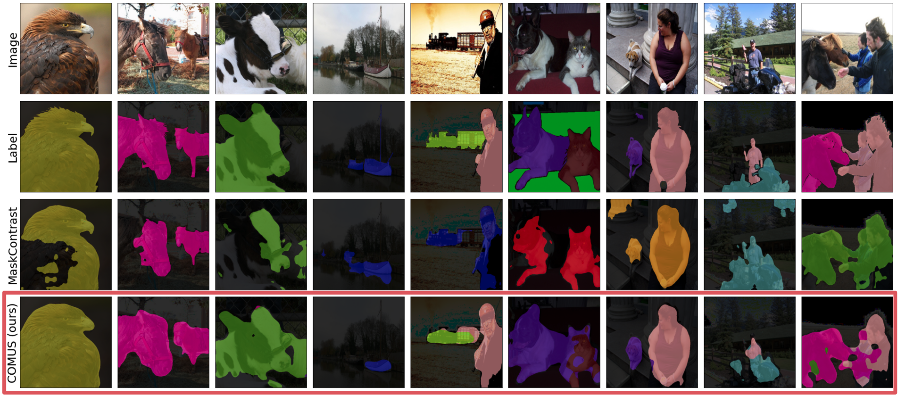

# Unsupervised Semantic Segmentation with Self-supervised Object-centric Representations.


```
@inproceedings{
zadaianchuk2023unsupervised,
title={Unsupervised Semantic Segmentation with Self-supervised Object-centric Representations},
author={Andrii Zadaianchuk and Matthaeus Kleindessner and Yi Zhu and Francesco Locatello and Thomas Brox},
booktitle={International Conference on Learning Representations},
year={2023},
url={https://openreview.net/forum?id=1_jFneF07YC}}
```
## Install
0. Install poetry: `curl -sSL https://install.python-poetry.org | python3 -
`
1. Clone this repository
2. Create poetry environment: `poetry install`
3. Activate the poetry virtual environment: `poetry shell`
4. Download PASCAL VOC and MS COCO datasets and change dataset and results paths in config files.
   ```bash
   python ./scripts/download_coco.py --download-dir $PWD/data/COCO --split train
   python ./scripts/download_coco.py --download-dir $PWD/data/COCO --split validation
   python ./scripts/download_pascal.py --download-dir $PWD/data/PASCAL_VOC
   ```
5. Download BasNet pre-trained with predictions from DeepUSPS from [here](https://github.com/wvangansbeke/Unsupervised-Semantic-Segmentation/tree/main/saliency).
   For convenience, you can use `wget` to download google drive file directly:
   ```bash
   bash ./scripts/download_unsupervised_basnet.sh ./data/basnet_unsupervised.pth
   ```
   Please update path to the checkpoint in the dataset config files if you change the download folder or filename.

## Experiments

To run clustering iteration activate poetry env and run one of the experiments:

```bash
python comus/clustering/objects_clustering.py dataset=pascal dataset.split=val clustering.core_size=100 pathes.repo=$PWD
```

```bash
python comus/clustering/objects_clustering.py dataset=coco dataset.split=val clustering.core_size=100 pathes.repo=$PWD
```

To run full COMUS training on PASCAL VOC dataset activate poetry env and run:

```bash
python comus/main.py dataset=pascal self_training=pascal eval_model=pascal pathes.repo=$PWD
```
